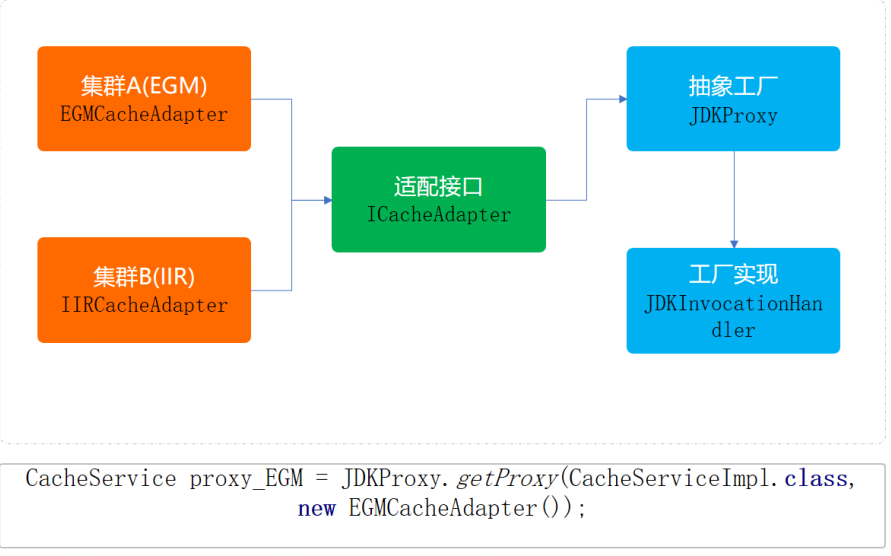

结构类图

总结：

抽象⼯⼚模式，所要解决的问题就是在⼀个产品族，存在多个不同类型的产品(Redis集群、操作系
统)情况下 接⼝选择 的问题。⽽这种场景在业务开发中也是⾮常多⻅的，只不过可能有时候没有
将它们抽象化出来。

你的代码只是被ifelse埋上了！ 当你知道什么场景下何时可以被抽象⼯程优化代码，那么你的代码
层级结构以及满⾜业务需求上，都可以得到很好的完成功能实现并提升扩展性和优雅度。

那么这个设计模式满⾜了:单⼀职责、开闭原则、解耦等优点，但如果说随着业务的不断拓展，可能会造成类实现上的复杂度。但也可以说算不上缺点，因为可以随着其他设计⽅式的引⼊和代理类
以及⾃动⽣成加载的⽅式降低此项缺点